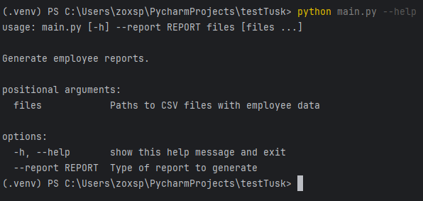
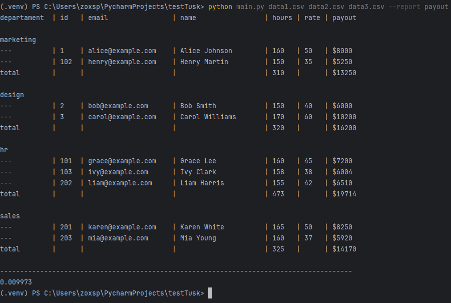
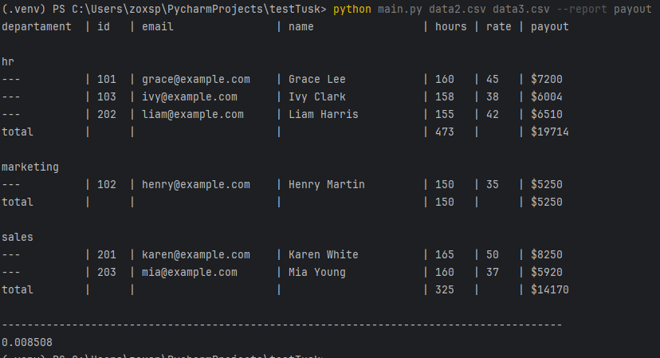
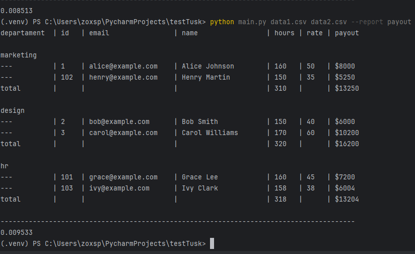
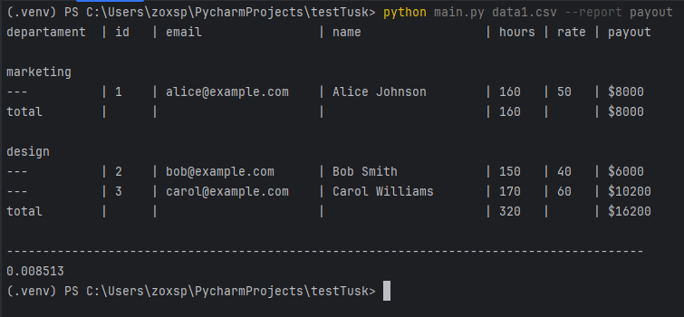

## 📊 Employee Report Generator
Приложение на Python для генерации отчётов о выплатах сотрудникам на основе CSV-файлов с данными. Упрощает расчет выплат по отделам и предоставляет читаемый консольный вывод.

### 📦 Возможности
Чтение одного или нескольких CSV-файлов с данными сотрудников

Поддержка отчетов по выплатам (`--report payout`)

Группировка сотрудников по отделам

Подсчет общего количества часов и суммы выплат на отдел

Простая CLI-интерфейс через argparse

###🧾 Формат входного CSV-файла
Файл должен содержать заголовок и данные в следующем виде:
```csv
id,name,email,hours_worked,department,rate
1,John Doe,john@example.com,40,engineering,30
2,Jane Smith,jane@example.com,35,sales,25
```
### 🚀 Запуск
Убедись, что у тебя установлен Python 3.6 или выше.

1. Установка зависимостей
Нет внешних зависимостей — используется только стандартная библиотека Python.

2. Запуск приложения
```bash
python report.py data1.csv data2.csv --report payout
```
3. data1.csv data2.csv — один или несколько CSV-файлов

4. `--report payout` — тип отчёта (в данный момент поддерживается только payout)

### 🧪 Примеры вывода

Запуск команды приложения с флагом --help: 


Запуск команды приложения с флагом --report c параметрами data1.csv data2.csv data3.csv: 


Запуск команды приложения с флагом --report c параметрами data2.csv data3.csv:  


Запуск команды приложения с флагом --report c параметрами data1.csv data2.csv:  


Запуск команды приложения с флагом --report c параметрами data1.csv:  


### ⚠️ Обработка ошибок
Если файл не существует — выводится предупреждение.

Если тип отчёта не поддерживается — выводится сообщение об ошибке.

### 🧪 Тесты
Тесты можно запускать с помощью:
```bash
python -m unittest test.py
```
